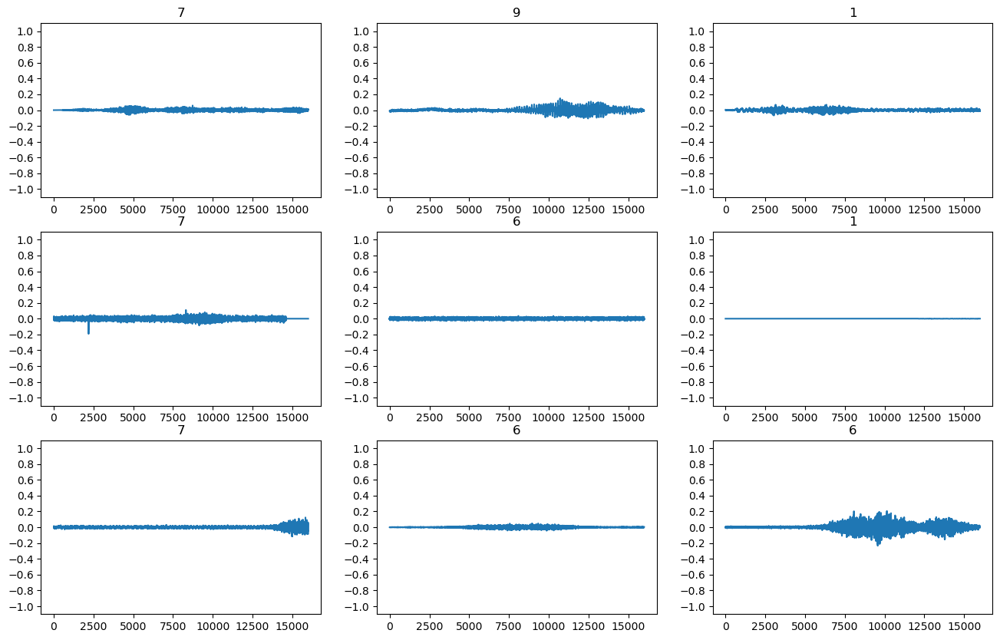
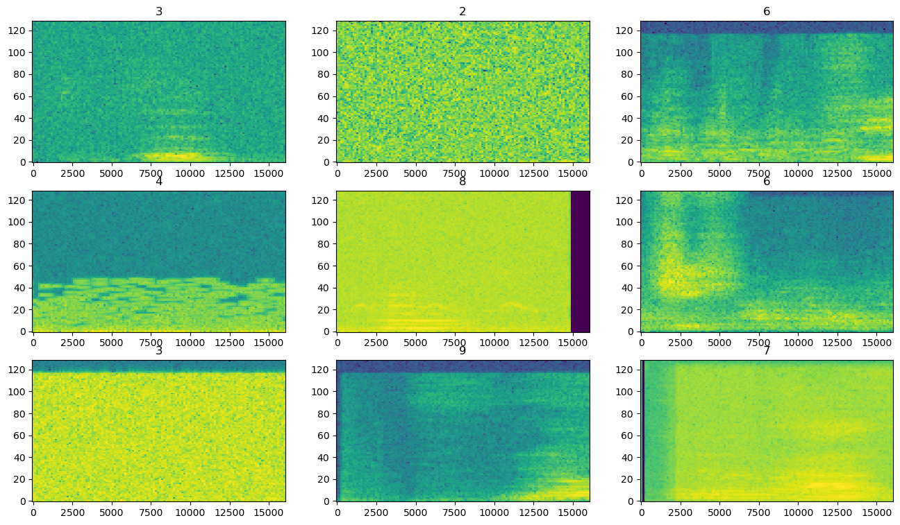
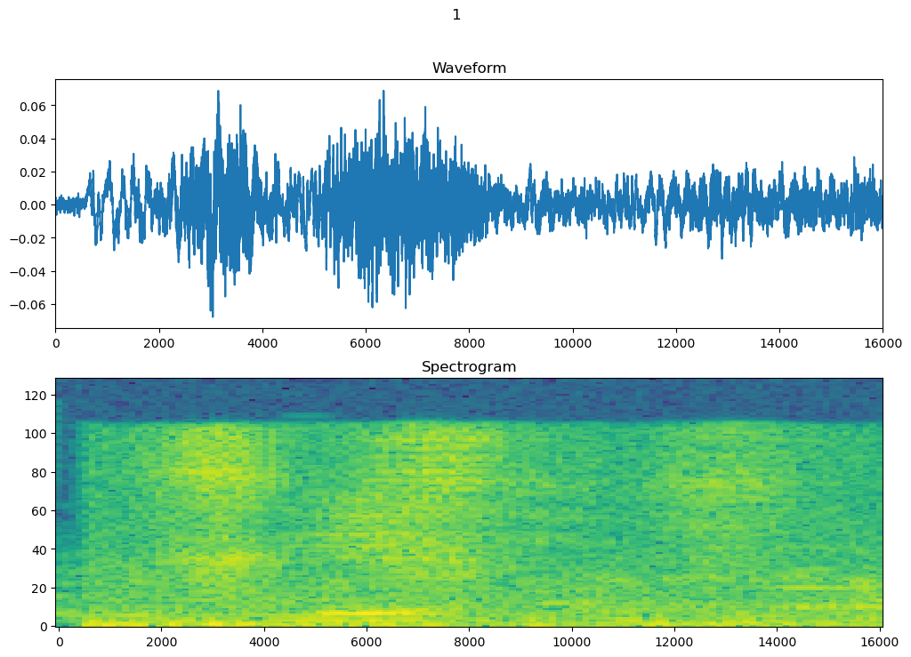
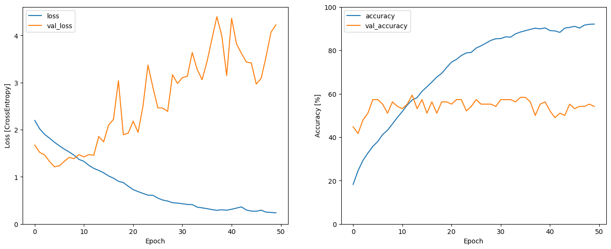
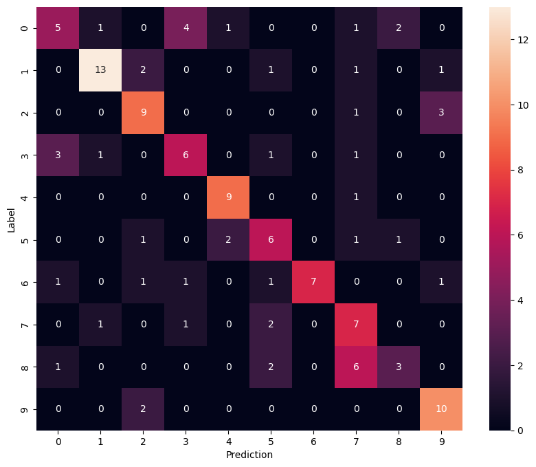
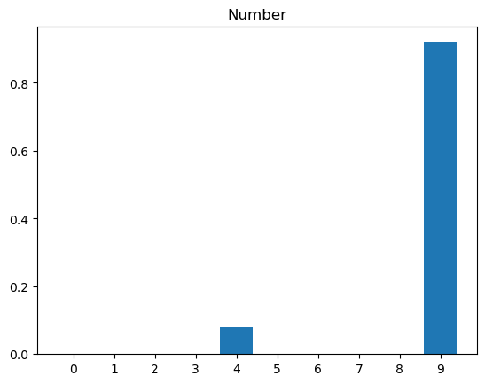

# Spoken Digit Recognition with Real-Time Microphone Input

## Overview
A CNN-based speech recognition system that classifies spoken digits (0–9) 
from audio, with real-time microphone input support. Audio is converted to 
spectrograms using Short-Time Fourier Transform (STFT) and fed into a CNN 
as image-like input.

## Dataset
- 10,308 audio files across 10 classes (digits 0–9)
- 8,247 files for training, 1,101 for validation/test
- Audio sampled at 16,000 Hz, 1 second per sample
- Dataset was pre-augmented with noise and distortion by the collectors
  (recordings are intentionally hard to understand for humans)

## Approach
### Audio Processing Pipeline
- Raw audio waveform → STFT → magnitude spectrogram → CNN input
- Spectrograms resized to 64x64 for efficient processing
- Spectrogram normalization using adaptive Normalization layer

### Model Architecture
- Conv2D (32) → MaxPooling
- Conv2D (64) → MaxPooling
- Conv2D (128) → MaxPooling
- Dropout → Flatten → Dense (10, softmax)

### Training
- Optimizer: Adam (lr=0.001)
- Loss: Sparse Categorical Crossentropy
- Epochs: 50
- Checkpoint callbacks to save best model by validation accuracy

## Results
- Test accuracy: ~60% on noisy/distorted dataset
- The low validation accuracy is expected — the dataset contains 
  heavily distorted audio that is difficult even for humans to recognise
- Model performs significantly better on clean recordings:
  tested on self-recorded voice samples converted from m4a to wav,
  achieving correct predictions on digits 0–9 (only digit 5 confused with 7)

## Real-Time Microphone Input
The final section connects to a live microphone using PyAudio, captures 
1-second audio chunks continuously, converts each chunk to a spectrogram 
in real time, and predicts the spoken digit immediately. Press 'q' to stop.

## Visualisations

### Audio Waveforms

### Spectrograms

### Waveform and Spectrogram (Digit 1)

### Training Curves

### Confusion Matrix

### Prediction Example (Digit 9 — 92% confidence)

## Tech Stack
- Python
- TensorFlow / Keras
- PyAudio (real-time microphone input)
- pydub (audio format conversion)
- NumPy, Matplotlib, Seaborn
